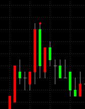
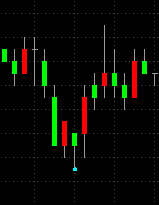

# Pivot Point Breakout: 枢轴点突破模型

# 交易原理
这是一个传统的趋势交易模型，用于演示如何使用AlgoSE原生SDK编写交易模型。

Pivot Point定义：  
如果某个价位，它左边n条K线，右边m条K线（n,m为参数）的收盘价都比它低（高），那么它就是一个swing high(swing low)。  
Swing High如下所示：  
  
Swing Low如下所示：  
  

如果当前价格突破Swing High或Swing Low，则可以进场做多或做空。

# 模型依据
模型的依据大致有以下两点：   
1. 趋势：与所有基于趋势的交易模型一致，市场无效会产生趋势。  
2. 被实现的预言：在市场中，如果所有人或大部分人相信某个点位是关键点位，那么它就会成为一个关键点位。
  
# 模型部署
编译成dll后，使用AlgoSE引擎加载对应的模型配置文件即可。